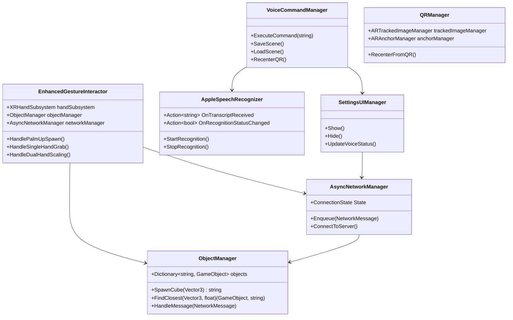

# Collaborative MR Cube Builder for Apple Vision Pro

## 1. Projektziele & Intentionen

**Immersive Kreativität**  
Nutzer können spontan 3D-Cubes in Mixed Reality erzeugen und mit natürlichen Handgesten manipulieren.

**Multi-Device Collaboration**  
Mehrere Vision Pro Headsets bleiben synchron, sodass entfernte oder ko-lokalisierte Nutzer dieselbe räumliche Szene teilen.

**Robuste räumliche Stabilität**  
QR-basiertes Rezentrieren und AR-Anker verhindern Drift in kleinen und großen Umgebungen.

**Hands-Free & Tangible Controls**  
Sprachbefehle (Apple Speech Framework, on-device) und ein Settings-UI ermöglichen vollständige Steuerung – auch wenn die Hände beschäftigt sind.

**Erweiterbarkeit & Wartbarkeit**  
Architektur für Objekte, Materialien, Networking und Logging ermöglicht einfache Erweiterungen mit minimalen Code-Änderungen.

## 2. Wichtige Features

### 2.1 **Erweiterte Gestensteuerung**
- **Palm-Up Gesture**: Spontanes Erzeugen von Marmor-Textur-Cubes an der Handposition
- **Hand Grab Gesture**: Greifen und Verschieben von Cubes mit natürlicher Rotation
- **Dual Hand Pinch Gesture**: Natürliche Skalierung von 3D-Objekten durch Abstand zwischen beiden Händen

### 2.2 **Persistenz**
- **Voice "save scene"** oder Save Scene Button → Serialisiert alle Cube-IDs, Positionen, Rotationen & Skalierungen zu scene.json
- **Voice "scene load"** oder Load Scene Button → Zeigt Datei-Picker, liest scene.json, löscht & respawnt Cubes

### 2.3 **Multi-Device Synchronisation**
- **Async WebSocket Client** → Enqueue JSON-Nachrichten (spawn/update/delete/clear) mit Retry-Logic
- **Node.js Broker** → Broadcastet eingehende Nachrichten an alle Clients im LAN
- **Settings UI** → Konfiguriere Server IP & Port, Connect/Disconnect, mit Echtzeit-Status-Indikator

### 2.4 **Räumliche Verankerung & Stabilisierung**
- **QR-Code Erkennung** (ARFoundation image tracking) beim App-Start oder via "set qr" →
  - Asynchrones Erstellen eines ARAnchors an der QR-Pose
  - Parenting des XROrigin unter diesem Anchor für driftfreie Stabilität
- **Manual Handler Fallback** → Falls QR nicht sichtbar, greife ein schwebendes Handler-Objekt zum Rezentrieren

### 2.5 **Sprachinteraktion (Apple Speech Framework)**
- **On-Device Spracherkennung** für Vision Pro, iOS, macOS
- **Unterstützte Befehle**:
  - "save scene" → Speichern des Zustands
  - "scene load" → Laden des Zustands
  - "set qr" → Rezentrieren via QR
  - "open settings" → Settings-Panel öffnen
  - "clear scene" → Alle Objekte löschen

### 2.6 **Settings UI (TextMeshPro)**
**Eingaben:**
- Server IP (TMP_InputField)
- Server Port (TMP_InputField)
- OpenAI API Key (TMP_InputField)

**Buttons:**
- Save Config → Persistierung via PlayerPrefs
- Connect → (Re)establish WebSocket
- Save Scene / Load Scene / Clear Scene
- Recenter QR
- Close Settings

**Status-Indikator:** Image getönt grün/gelb/rot für Connected/Connecting/Disconnected.

### 2.7 **Erweiterbare Objekt- & Materialverwaltung**
- **ObjectManager (Singleton)** → Behandelt "spawn", "update", "delete", "clear" Aktionen von JSON
- **SpawnCube & FindClosest** Helfer für lokale Gesten
- **Dynamische Parameter:** Position, Rotation, Skalierung, Farbe, MaterialName, benutzerdefinierte Werte via Newtonsoft.Json.Linq
- **MaterialLibrary (Singleton)** → Mapped Material-Namen → Instanzen für einfache Runtime-Swaps

### 2.8 **Node.js Server & Logging**
- **WebSocket Broker** auf Port 8080 mit ws
- **Rotating Logs** mit winston
- **Broadcast** aller eingehenden Nachrichten an alle Clients
- **Error Handling** mit Graceful Degradation

## 3. Architektur & Zentrale Klassen

### 3.1 **EnhancedGestureInteractor.cs**
**Verantwortlich für:**
- Palm-Up Gesture Erkennung für Cube-Spawning
- Hand Grab Gesture für Move/Rotate
- Dual Hand Pinch Gesture für natürliche Skalierung
- Integration mit ObjectManager und AsyncNetworkManager

**Wichtige Methoden:**
- `TryGetPalmUpGesture()`: Erkennung der Palm-Up Geste
- `TryGetGrabGesture()`: Erkennung der Grab-Geste
- `TryGetDualHandPinch()`: Erkennung der Dual-Hand-Pinch-Geste
- `HandleSingleHandGrab()`: Behandlung der Einhand-Grab-Logik
- `HandleDualHandScaling()`: Behandlung der Dual-Hand-Skalierung

### 3.2 **ObjectManager.cs**
**Verantwortlich für:**
- Lebenszyklus-Management aller 3D-Objekte
- Netzwerk-Nachrichten-Verarbeitung
- Lokale Objekt-Instanziierung

**Wichtige Methoden:**
- `SpawnCube()`: Erstellt neue Cubes mit eindeutiger ID
- `FindClosest()`: Findet nächstes Objekt für Interaktion
- `HandleMessage()`: Verarbeitet Netzwerk-Nachrichten
- `ApplyParameters()`: Wendet Position, Rotation, Skalierung an

### 3.3 **AppleSpeechRecognizer.cs**
**Verantwortlich für:**
- Native Apple Speech Framework Integration
- On-Device Spracherkennung
- Editor-Fallback für Entwicklung

**Wichtige Features:**
- Platform-spezifische Implementierung (VisionOS/iOS/macOS)
- Status-Tracking für Verfügbarkeit
- Fehlerbehandlung und Graceful Degradation

### 3.4 **VoiceCommandManager.cs**
**Verantwortlich für:**
- Verarbeitung erkannte Sprachbefehle
- Mapping zu entsprechenden Aktionen
- Fallback-Integration

**Unterstützte Befehle:**
- "save scene" → SceneDataHandler.SaveScene()
- "scene load" → SceneDataHandler.LoadSceneNetworked()
- "set qr" → QRManager.RecenterFromQR()
- "open settings" → SettingsUIManager.Show()

### 3.5 **AsyncNetworkManager.cs**
**Verantwortlich für:**
- WebSocket-Verbindung mit Retry-Logic
- Nachrichten-Queue und Broadcasting
- Verbindungsstatus-Management

**Wichtige Features:**
- Asynchrone Verbindung mit CancellationToken
- Automatische Reconnection
- Thread-sichere Nachrichten-Queue

### 3.6 **QRManager.cs**
**Verantwortlich für:**
- QR-Code Erkennung via ARFoundation
- Asynchrones ARAnchor-Erstellen
- XROrigin Rezentrierung

**Wichtige Methoden:**
- `TryRecenterAsync()`: Asynchrones Rezentrieren
- `RecenterFromQR()`: Manueller QR-Recenter

## 4. Datenstruktur & Netzwerk-Protokoll

### 4.1 **NetworkMessage Format**
```json
{
  "action": "spawn|update|delete|clear",
  "id": "unique-object-id",
  "objectType": "Cube",
  "parameters": {
    "position": [x, y, z],
    "rotation": [x, y, z, w],
    "scale": [x, y, z],
    "color": {"r": 1.0, "g": 1.0, "b": 1.0, "a": 1.0},
    "materialName": "marble"
  }
}
```

### 4.2 **Scene Data Format**
```json
{
  "cubes": [
    {
      "id": "cube-guid",
      "pos": [x, y, z],
      "rot": [x, y, z, w],
      "scale": [x, y, z]
    }
  ]
}
```

## 5. Klassendiagramm



## 6. Beispielabläufe

### 6.1 **Cube Spawning & Manipulation**
```
1. User macht Palm-Up Geste
   ↓
2. EnhancedGestureInteractor erkennt Geste
   ↓
3. ObjectManager.SpawnCube() erstellt Cube
   ↓
4. AsyncNetworkManager broadcastet spawn message
   ↓
5. Alle verbundenen Clients erhalten Cube
```

### 6.2 **Hand Grab Manipulation**
```
1. User macht Grab-Geste (Thumb + Index + Middle)
   ↓
2. EnhancedGestureInteractor erkennt Geste
   ↓
3. FindClosest() findet nächstes Objekt
   ↓
4. StartGrab() speichert Offset
   ↓
5. UpdateGrab() folgt Handbewegung
   ↓
6. AsyncNetworkManager broadcastet update
```

### 6.3 **Dual Hand Scaling**
```
1. User macht Pinch mit beiden Händen
   ↓
2. EnhancedGestureInteractor erkennt Dual-Pinch
   ↓
3. StartDualHandScaling() speichert initiale Werte
   ↓
4. UpdateDualHandScaling() berechnet Skalierung
   ↓
5. Objekt skaliert basierend auf Handabstand
   ↓
6. AsyncNetworkManager broadcastet update
```

### 6.4 **Voice Command Processing**
```
1. User spricht "save scene"
   ↓
2. AppleSpeechRecognizer erkennt Audio
   ↓
3. VoiceCommandManager.ProcessCommand()
   ↓
4. SceneDataHandler.SaveScene()
   ↓
5. JSON wird zu scene.json gespeichert
```

## 7. LMM Prompt für Projektbeschreibung

```
Beschreibe das "Collaborative MR Cube Builder for Apple Vision Pro" Projekt:

Ein Unity-basiertes Mixed Reality System für Apple Vision Pro, das kollaborative 3D-Cube-Manipulation ermöglicht. Das System verwendet erweiterte Handgesten (Palm-Up zum Spawnen, Hand Grab zum Bewegen/Rotieren, Dual Hand Pinch zum Skalieren), on-device Spracherkennung via Apple Speech Framework, und WebSocket-basierte Multi-Device-Synchronisation. 

Kernfunktionen:
- Immersive Gestensteuerung mit natürlicher Handinteraktion
- Real-time Multi-Device Collaboration über WebSocket
- QR-basierte räumliche Verankerung für Stabilität
- Voice Commands mit Fallback-System
- Scene Persistence und Loading
- Erweiterbare Objekt- und Materialverwaltung

Technische Highlights:
- EnhancedGestureInteractor für präzise Handgesten-Erkennung
- AppleSpeechRecognizer für native Spracherkennung
- AsyncNetworkManager für robuste Netzwerkkommunikation
- ObjectManager für zentrales Objekt-Lifecycle-Management
- QRManager für räumliche Stabilität
- Fallback-System für robuste Benutzerinteraktion

Das Projekt demonstriert moderne VisionOS-Entwicklung mit Fokus auf natürliche Interaktion, Kollaboration und Stabilität in Mixed Reality Umgebungen.
```

## 8. Setup & Konfiguration

### 8.1 **Erforderliche Komponenten**
- Unity 2022.3 LTS+
- Apple Vision Pro Device/Simulator
- Xcode 15+ für Native Plugin
- Node.js für WebSocket Server

### 8.2 **Native Plugin Integration**
- `NativeSpeechPlugin/` in Xcode Project kopieren
- Info.plist Berechtigungen hinzufügen
- Bridging Header konfigurieren

### 8.3 **WebSocket Server**
```bash
cd NodeJs_Server
npm install
node server.js
```

### 8.4 **Inspector-Konfiguration**
- EnhancedGestureInteractor Dependencies zuweisen
- ObjectManager Prefab-Liste konfigurieren
- VoiceCommandManager Referenzen setzen
- Settings UI Buttons zuweisen

## 9. Fallback-System

### 9.1 **Spracherkennung Fallback**
- Editor Text-Input für Entwicklung
- Tastatur-Shortcuts (F1-F5)
- UI-Buttons für alle Voice Commands
- Status-Indikatoren für Verfügbarkeit

### 9.2 **Gesten-Fallback**
- Automatische Erkennung der Platform-Unterstützung
- Graceful Degradation bei fehlenden Hand-Tracking
- Alternative Eingabemethoden verfügbar

## 10. Performance & Optimierung

### 10.1 **Gesten-Erkennung**
- Effiziente Hand-Joint-Berechnung
- Threshold-basierte Erkennung
- Cooldown für Spawn-Gesten

### 10.2 **Netzwerk-Optimierung**
- Batch-Updates für häufige Änderungen
- Komprimierte JSON-Nachrichten
- Retry-Logic für verlorene Verbindungen

### 10.3 **Memory Management**
- Objekt-Pooling für Cubes
- Effiziente Dictionary-Lookups
- Garbage Collection Optimierung 