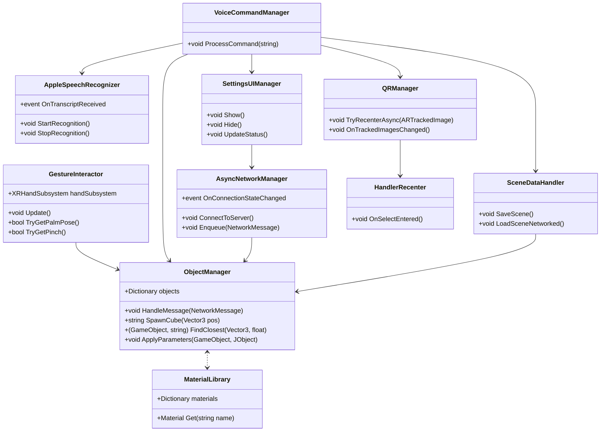

# Collaborative MR Cube Builder for Apple Vision Pro

## 1. Projektziele & Intentionen

**Immersive Kreativität**  
Nutzer können spontan 3D-Cubes in Mixed Reality erzeugen und mit natürlichen Handgesten manipulieren.

**Multi-Device Collaboration**  
Mehrere Vision Pro Headsets bleiben synchron, sodass entfernte oder ko-lokalisierte Nutzer dieselbe räumliche Szene teilen.

**Robuste räumliche Stabilität**  
QR-basiertes Rezentrieren und AR-Anker verhindern Drift in kleinen und großen Umgebungen.

**Hands-Free & Tangible Controls**  
Sprachbefehle (Apple Speech Framework, on-device) und ein Settings-UI ermöglichen vollständige Steuerung – auch wenn die Hände beschäftigt sind.

**Erweiterbarkeit & Wartbarkeit**  
Architektur für Objekte, Materialien, Netzwerk und Logging erlaubt das einfache Hinzufügen neuer Objekttypen und Parameter.

---

## 2. Hauptfeatures

### 2.1 Objekt-Generierung & Manipulation
- **Palm-Up-Geste**: Spawnt sofort einen marmorierten Cube an der Hand.
- **Pinch-Geste**: Greifen & Ziehen zum Umpositionieren; Pinch-Distanz skaliert die Größe.
- **ObjectManager**: Zentrale Verwaltung aller Objekte, unterstützt dynamische Parameter (Position, Skalierung, Material, Farbe, Custom-Values).

### 2.2 Persistenz
- **„save scene“ (Voice oder Button)**: Serialisiert alle Cube-IDs, Positionen & Skalierungen in `scene.json`.
- **„scene load“ (Voice oder Button)**: Öffnet File Picker, lädt Szene, räumt auf & spawnt Cubes neu.
- **SceneDataHandler**: Verantwortlich für das Speichern und Laden des Szenenzustands.

### 2.3 Multi-Device Synchronisation
- **AsyncNetworkManager**: Asynchrone WebSocket-Kommunikation, verarbeitet JSON-Nachrichten (spawn/update/delete/clear) mit Retry-Logik.
- **Node.js Broker**: Broadcastet Nachrichten an alle Clients im LAN.
- **Settings UI**: Konfiguration von Server-IP/Port, Connect/Disconnect, Statusanzeige.

### 2.4 Spatial Anchoring & Stabilisierung
- **QRManager**: Erkennt QR-Codes (ARFoundation), erzeugt asynchron einen ARAnchor am QR-Pose, XROrigin wird darunter geparkt.
- **HandlerRecenter**: Fallback, wenn QR nicht sichtbar – schwebender Handler kann zum Rezentrieren gegriffen werden.

### 2.5 Voice Interaction (Apple Speech Framework)
- **AppleSpeechRecognizer**: Native Integration des Apple Speech Frameworks (Swift-Plugin), Echtzeit-Spracherkennung on-device.
- **VoiceCommandManager**: Verarbeitet erkannte Sprachbefehle und löst entsprechende Aktionen aus.
- **Editor-Fallback**: Im Unity Editor kann ein Textfeld genutzt werden, um Sprachbefehle zu simulieren.
- **Unterstützte Kommandos**:
  - „save scene“ → Speichern
  - „scene load“ → Laden
  - „set qr“ → QR-Rezentrierung
  - „open settings“ → Settings-Panel anzeigen

### 2.6 Settings UI (TextMeshPro)
- **Inputs**: Server IP, Port, API Key
- **Buttons**: Save Config, Connect, Save/Load/Clear Scene, Recenter QR, Close
- **Statusanzeige**: Farbiges Icon für Verbindungsstatus

### 2.7 Erweiterbares Objekt- & Materialmanagement
- **ObjectManager (Singleton)**: Verarbeitet „spawn“, „update“, „delete“, „clear“ aus JSON.
- **SpawnCube & FindClosest**: Helfer für lokale Gesten.
- **MaterialLibrary (Singleton)**: Materialnamen → Instanzen für schnellen Tausch.

### 2.8 Node.js Server & Logging
- **WebSocket-Broker** (Port 8080, ws): Rotierende Logfiles (5MB, ISO-Timestamp), Logging aller JSON-Nachrichten.

---

## 3. Technischer Stack & Abhängigkeiten

- **Unity 2022.3 LTS** mit visionOS (OpenXR), XR Hands, AR Foundation & ARKit XR Plugin
- **Apple Speech Framework** (Swift-Plugin, on-device)
- **Newtonsoft JSON** (com.unity.nuget.newtonsoft-json) für dynamische Payloads
- **TextMeshPro – UGUI** für UI
- **Standalone File Browser** für Szenen-Laden
- **Node.js + ws** für Netzwerk & Logging

---

## 4. Projektstruktur (Ausschnitt)

```
Assets/NextReality/
├── Materials/         # Materialien für Cubes & Marker
├── Prefabs/           # SpawnCube, HandlerPrefab, OriginMarker
├── Scenes/            # cubes.unity (Hauptszene)
├── Images/            # QR-Codes für Tracking
├── Scripts/           # C#-Skripte für Logik, Netzwerk, UI, etc.
├── Plugins/           # NativeSpeechPlugin (Swift, Bridging Header)
```

---

## 5. Klassendiagramm (Mermaid)



---

## 6. Beispielabläufe (User Stories & Sequenzen)

### **A. Cube-Spawning und Manipulation (Handgesten)**
1. Nutzer hält die Hand mit der Handfläche nach oben → **GestureInteractor** erkennt Palm-Up → **ObjectManager.SpawnCube** wird aufgerufen.
2. Nutzer macht eine Pinch-Geste und bewegt die Hand → **GestureInteractor** erkennt Pinch → Cube wird gegriffen und mit der Hand bewegt.
3. Pinch-Distanz wird verändert → Cube skaliert sich entsprechend.

### **B. Szenen speichern und laden (Voice & UI)**
1. Nutzer sagt „save scene“ oder klickt auf „Save Scene“ im UI.
2. **VoiceCommandManager** oder **SettingsUIManager** ruft **SceneDataHandler.SaveScene** auf.
3. Szene wird als JSON gespeichert und optional an andere Geräte synchronisiert.
4. Nutzer sagt „scene load“ oder klickt auf „Load Scene“ → **SceneDataHandler.LoadSceneNetworked** lädt und synchronisiert die Szene.

### **C. Multi-Device Synchronisation**
1. Nutzer verbindet sich über das Settings-UI mit dem Node.js-Server.
2. **AsyncNetworkManager** baut WebSocket-Verbindung auf.
3. Aktionen wie Spawn, Update, Delete werden als JSON-Nachrichten an den Server gesendet und an alle Clients verteilt.
4. **ObjectManager** verarbeitet eingehende Nachrichten und hält die Szene synchron.

### **D. Spatial Anchoring & QR-Rezentrierung**
1. Beim Start scannt die App nach einem QR-Code.
2. **QRManager** erkennt den Code, erstellt einen ARAnchor und parkt die XROrigin darunter.
3. Falls kein QR sichtbar: Nutzer greift HandlerPrefab, um die Szene manuell zu rezentrieren.

### **E. Sprachsteuerung (Apple Speech Framework)**
1. Nutzer sagt „open settings“ → **AppleSpeechRecognizer** erkennt das Kommando.
2. **VoiceCommandManager** ruft **SettingsUIManager.Show()** auf.
3. Nutzer kann weitere Kommandos sprechen oder UI-Buttons nutzen.

---

## 7. LMM Prompt zur Projektbeschreibung

> **Prompt für ein Language Model:**  
> „Beschreibe ein Unity-Projekt namens 'Collaborative MR Cube Builder for Apple Vision Pro' mit folgenden Eigenschaften:
> - Nutzer können spontan 3D-Cubes in Mixed Reality erzeugen und mit natürlichen Handgesten (Palm-Up, Pinch) manipulieren.
> - Mehrere Vision Pro Headsets bleiben synchronisiert, sodass entfernte oder ko-lokalisierte Nutzer dieselbe räumliche Szene teilen.
> - QR-basiertes Rezentrieren und AR-Anker verhindern Drift in kleinen und großen Umgebungen.
> - Sprachbefehle (über das Apple Speech Framework, on-device) und ein Settings-UI ermöglichen vollständige Steuerung, auch wenn die Hände beschäftigt sind.
> - Szenen können gespeichert und geladen werden (inkl. File Picker und JSON-Serialisierung).
> - Netzwerkkommunikation erfolgt über einen Node.js WebSocket-Broker mit rotierenden Logfiles.
> - Die Architektur ist so gestaltet, dass neue Objekttypen und Parameter einfach hinzugefügt werden können.
> - Das Projekt nutzt Unity 2022.3 LTS, AR Foundation, XR Hands, TextMeshPro, Newtonsoft JSON und das Apple Speech Framework.“

---

**Diese Datei beschreibt die Intentionen, Features, Architektur, Abläufe und Erweiterbarkeit des Collaborative MR Cube Builder Projekts für Apple Vision Pro.** 