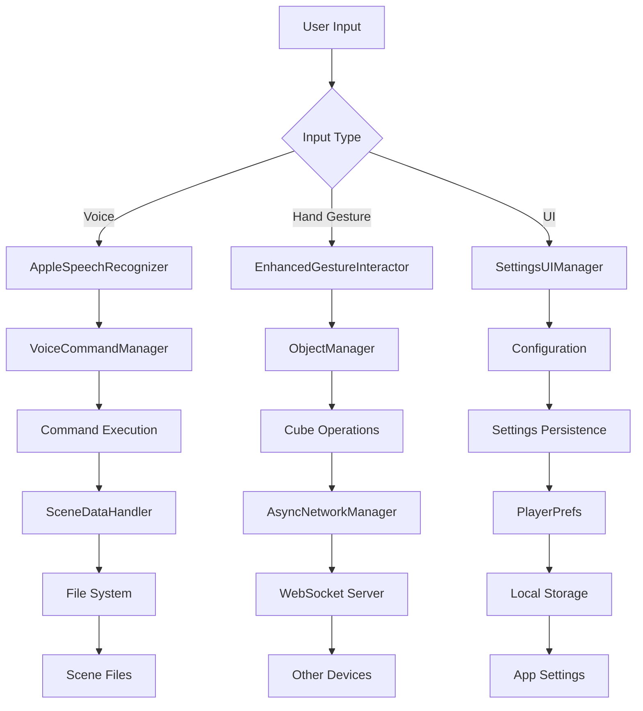

# Collaborative MR Cube Builder for Apple Vision Pro

A Unity-based mixed reality application that enables collaborative 3D cube creation and manipulation on Apple Vision Pro devices. This project combines spatial computing, voice commands, and real-time networking to create an immersive collaborative experience.

## 🎯 Project Overview

### Core Intentions
- **Immersive Creativity**: Spontaneous 3D cube generation and manipulation using natural hand gestures
- **Multi-Device Collaboration**: Synchronized experiences across multiple Vision Pro headsets
- **Spatial Stability**: QR-based recentering and AR anchors for drift-free experiences
- **Hands-Free Controls**: Voice commands and UI controls for complete interaction
- **Extensibility**: Modular architecture for easy feature additions

### Key Features
- **Enhanced Gesture System**: Hand grab gestures for moving/rotating, dual hand pinch for natural scaling
- Voice command system with Apple Speech Framework
- Multi-device synchronization via WebSocket
- QR code-based spatial anchoring
- Scene persistence and loading
- Fallback input methods (keyboard, UI buttons)

## 📁 Project Structure

```
AVP_Cubes/
├── Assets/
│   ├── NextReality/           # Main application code
│   │   ├── Materials/         # 3D materials (marble.mat, marble2.mat)
│   │   ├── Prefabs/          # GameObjects (SpawnCube, HandlerPrefab, OriginMarker)
│   │   ├── Scenes/           # Unity scenes (cubes.unity)
│   │   ├── Images/           # Reference images (QR codes)
│   │   ├── Scripts/          # C# scripts
│   │   └── README.md         # Detailed project documentation
│   ├── Packages/             # Unity packages and dependencies
│   └── Samples/              # PolySpatial samples and examples
├── NativeSpeechPlugin/       # Apple Speech Framework integration
├── NodeJs_Server/           # WebSocket server for multi-device sync
├── Builds/                  # Build outputs
└── ProjectSettings/         # Unity project configuration
```

## 🏗️ Architecture

### Core Components

#### 1. **Enhanced Gesture System**
- `EnhancedGestureInteractor.cs`: Advanced hand gesture recognition and manipulation
- `ObjectManager.cs`: Singleton managing cube lifecycle (spawn, update, delete, clear)
- `SpawnCube.cs`: Handles cube instantiation and positioning
- `MaterialLibrary.cs`: Dynamic material management and swapping

#### 2. **Voice Command System**
- `AppleSpeechRecognizer.cs`: Native Apple Speech Framework integration
- `VoiceCommandManager.cs`: Command processing and execution
- `FallbackCommandManager.cs`: Alternative input methods (keyboard, UI)

#### 3. **Networking & Synchronization**
- `AsyncNetworkManager.cs`: WebSocket client with retry logic
- `NodeJs_Server/server.js`: WebSocket broker for multi-device sync

#### 4. **Spatial Anchoring**
- `QRManager.cs`: QR code detection and spatial anchoring
- `HandlerRecenter.cs`: Manual recentering fallback

#### 5. **UI & Settings**
- `SettingsUIManager.cs`: Configuration panel and status indicators
- `FilePickerUI.cs`: Scene file management

### Data Flow



## 🚀 Setup Instructions

### Prerequisites
- Unity 2022.3 LTS or later
- Apple Vision Pro device or simulator
- Xcode 15+ for native plugin compilation
- Node.js for WebSocket server

### Installation

1. **Clone the Repository**
   ```bash
   git clone <repository-url>
   cd AVP_Cubes
   ```

2. **Open in Unity**
   - Launch Unity Hub
   - Add project from local folder
   - Open the project

3. **Configure Native Plugin**
   - Copy `NativeSpeechPlugin/` files to your Xcode project
   - Add required permissions to `Info.plist`:
     ```xml
     <key>NSSpeechRecognitionUsageDescription</key>
     <string>This app uses speech recognition for voice commands.</string>
     <key>NSMicrophoneUsageDescription</key>
     <string>This app uses microphone for voice commands.</string>
     ```

4. **Start WebSocket Server**
   ```bash
   cd NodeJs_Server
   npm install
   node server.js
   ```

5. **Build for Vision Pro**
   - File → Build Settings
   - Select VisionOS platform
   - Build and run on device

## 🎮 Usage

### Enhanced Gesture Controls
- **Palm-Up Gesture**: Spawn cube at hand position
- **Hand Grab Gesture**: Grab and move/rotate cubes with natural hand movement
- **Dual Hand Pinch**: Scale objects naturally by changing distance between hands

### Voice Commands
- **"Save Scene"**: Persist current scene state
- **"Scene Load"**: Load scene from file picker
- **"Set QR"**: Recenter using QR code
- **"Open Settings"**: Show settings panel
- **"Clear Scene"**: Remove all cubes

### Fallback Controls
- **F1-F5**: Keyboard shortcuts for voice commands
- **UI Buttons**: All commands available in settings panel
- **Editor Input**: Text field for command testing

## 📊 Data Structure

### Scene Data Format
```json
{
  "version": "1.0",
  "timestamp": "2024-01-01T12:00:00Z",
  "objects": [
    {
      "id": "cube_001",
      "type": "cube",
      "position": {"x": 0.0, "y": 1.0, "z": 0.0},
      "rotation": {"x": 0.0, "y": 0.0, "z": 0.0, "w": 1.0},
      "scale": {"x": 1.0, "y": 1.0, "z": 1.0},
      "material": "marble",
      "color": "#FFFFFF"
    }
  ]
}
```

### Network Message Format
```json
{
  "action": "spawn|update|delete|clear",
  "objectId": "cube_001",
  "data": {
    "position": {"x": 0.0, "y": 1.0, "z": 0.0},
    "rotation": {"x": 0.0, "y": 0.0, "z": 0.0, "w": 1.0},
    "scale": {"x": 1.0, "y": 1.0, "z": 1.0}
  }
}
```

### Configuration Storage
- **Server Settings**: IP, Port, API Keys
- **Voice Settings**: Recognition preferences
- **UI Settings**: Panel positions and visibility

## 🔧 Configuration

### Network Settings
- **Server IP**: Default `192.168.1.100`
- **Server Port**: Default `8080`
- **Connection Timeout**: 5 seconds
- **Retry Attempts**: 3

### Voice Recognition
- **Language**: English (en-US)
- **Sample Rate**: 16kHz
- **Fallback**: Editor text input, keyboard shortcuts

### Gesture Recognition
- **Palm-Up Threshold**: 0.8 (sensitivity)
- **Grab Distance**: 0.3m (interaction range)
- **Dual Hand Scale Threshold**: 0.05m (pinch sensitivity)
- **Scale Range**: 0.1x to 10x (min/max scaling)

### Spatial Anchoring
- **QR Code Size**: Minimum 10cm
- **Anchor Persistence**: Session-based
- **Fallback**: Manual handler object

## 🐛 Troubleshooting

### Common Issues

1. **Gesture Recognition Not Working**
   - Check hand tracking permissions
   - Verify XR Hands subsystem is active
   - Ensure proper lighting conditions
   - Use fallback methods (keyboard/UI)

2. **Voice Recognition Not Working**
   - Check microphone permissions
   - Verify platform support (iOS/VisionOS/macOS)
   - Use fallback methods (keyboard/UI)

3. **Network Synchronization Issues**
   - Verify server is running
   - Check IP/port configuration
   - Ensure devices are on same network

4. **Spatial Drift**
   - Use QR code recentering
   - Check lighting conditions
   - Verify AR anchor creation

5. **Build Errors**
   - Update Unity to latest LTS version
   - Verify VisionOS SDK installation
   - Check native plugin integration

### Debug Information
- Enable detailed logging in `EnhancedGestureInteractor.cs`
- Check Console for network status
- Monitor WebSocket server logs

## 📈 Performance Optimization

### Best Practices
- **Object Pooling**: Reuse cube GameObjects
- **LOD System**: Adjust detail based on distance
- **Spatial Partitioning**: Optimize collision detection
- **Network Optimization**: Batch updates, compress data

### Memory Management
- **Scene Cleanup**: Remove unused objects
- **Texture Compression**: Optimize material textures
- **Garbage Collection**: Minimize allocations

## 🔮 Future Enhancements

### Planned Features
- **Multi-User Avatars**: Visual representation of collaborators
- **Advanced Materials**: Procedural textures and effects
- **Gesture Recognition**: Custom hand gesture support
- **Scene Templates**: Pre-built scene layouts
- **Export Options**: 3D model export capabilities

### Technical Improvements
- **WebRTC Integration**: Direct peer-to-peer communication
- **Cloud Storage**: Scene persistence in cloud
- **AI Integration**: Smart object suggestions
- **Performance Monitoring**: Real-time performance metrics

## 📚 Documentation

### Additional Resources
- `Assets/NextReality/README.md`: Detailed project documentation
- `Assets/NextReality/FALLBACK_GUIDE.md`: Voice command fallback guide
- `NativeSpeechPlugin/README.md`: Native plugin integration guide

### API Reference
- **EnhancedGestureInteractor**: Advanced gesture recognition and manipulation
- **ObjectManager**: Cube lifecycle management
- **VoiceCommandManager**: Command processing system
- **AsyncNetworkManager**: Network synchronization
- **SettingsUIManager**: Configuration interface

## 🤝 Contributing

### Development Guidelines
1. Follow Unity coding standards
2. Add comprehensive error handling
3. Include unit tests for new features
4. Update documentation for changes
5. Test on actual Vision Pro device

### Code Style
- Use PascalCase for public methods
- Use camelCase for private variables
- Add XML documentation for public APIs
- Include error handling and logging

## 📄 License

This project is licensed under the MIT License - see the LICENSE file for details.

## 🙏 Acknowledgments

- **Apple**: VisionOS SDK and Speech Framework
- **Unity**: PolySpatial package and documentation
- **Open Source Community**: Various libraries and tools

---

**Version**: 1.0.0  
**Last Updated**: January 2024  
**Platform**: Apple Vision Pro (VisionOS)  
**Unity Version**: 2022.3 LTS+
